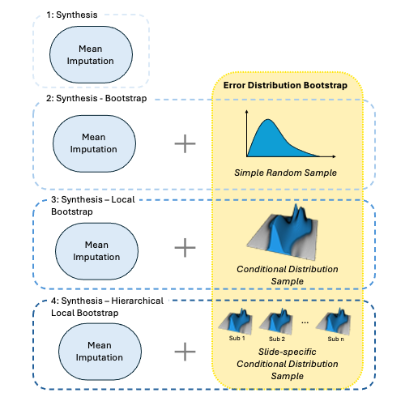
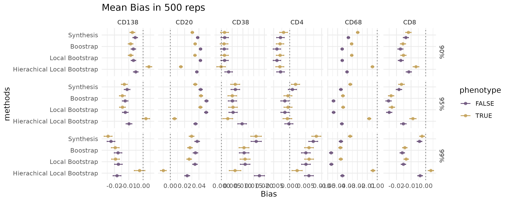
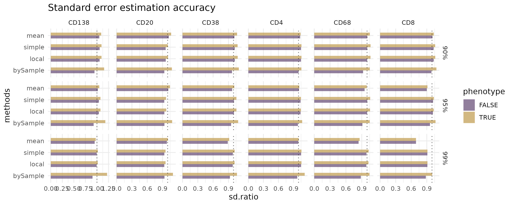
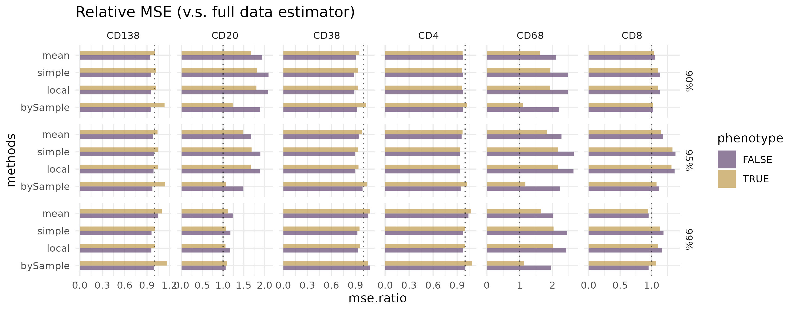
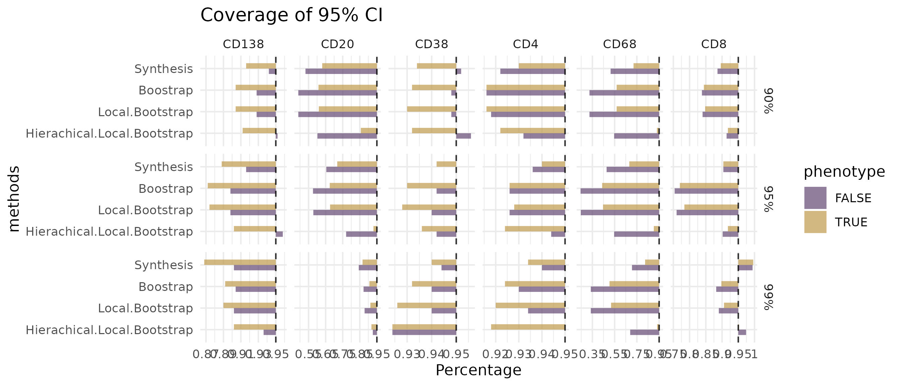
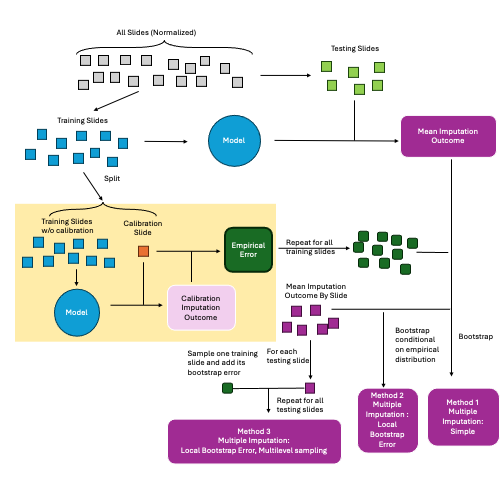
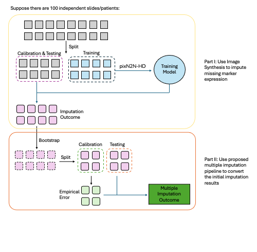

# Figure 1

This is the figure for the methods

# Figure 2

This is the figure for simulation analysis, mIF and Lasso

::: panel-tabset
## 1

Bias of the estimator This plot is a point&bar plot, where:

1.  the point: the mean bias across all bootstrap simulations: $$
      \hat{Bias}(\theta_{syn})=\frac1B\sum(\hat\theta^b_{syn}-\theta)
      $$
2.  The standard deviation times 1.96 $$
      s = \sqrt{\frac{1}{B-1}\sum_{b=1}^B(\theta^b_{syn}-\frac{\sum\hat\theta^b_{syn}}B)^2}
      $$

{.lightbox}

## 2

Figure 1.b: Accuracy of standard error estimation

This is fraction of

1.  Numerator $$
      \hat E(\hat{SE}(\hat\theta^b_{Imp}))=\frac1B\sum_{b=1}^B\hat{SE}(\hat\theta^b_{Imp})
      $$ where $\hat{SE}(\hat\theta^b_{Imp})$ is generated with the GEE parameter SE and rubin's rule.

2.  Denominator $$
      \hat{SE}(\hat\theta^b_{Imp})=\sqrt{\frac1{B-1}\sum_{b=1}^B(\hat\theta^b_{Imp}-\frac1B\sum{\hat\theta^b_{Imp}})^2}
      $$

{.lightbox}

## 3

Figure 1.c: relative efficiency

This is fraction of

1.  Numerator $$
      \sqrt{\frac1B\sum^B_{b=1}(\hat\theta^b_{Imp}-\theta)^2}
      $$
2.  Denominator $$
      \sqrt{\frac1B\sum^B_{b=1}(\hat\theta^b-\theta)^2}
      $$

{.lightbox}

## 4

Figure 1.d: coverage

This is the percentage number of times that the confidence interval of the estimator catches the true estimator $\theta$, out of $B$ bootstrap simlations. The confidence interval standard deviation is generated with GEE parameter SEs and rubin's rule.

{.lightbox}
:::

# Figure 3

This is the figure for simulation analysis, mIF and pixN2N

# Figure 4

This is the figure for simulation analysis, neuroimaging and cycleGAN

# Appendix Figure 1: Figure 2 pipeline

# Appendix Figure 2: Figure 3, 4 pipeline

